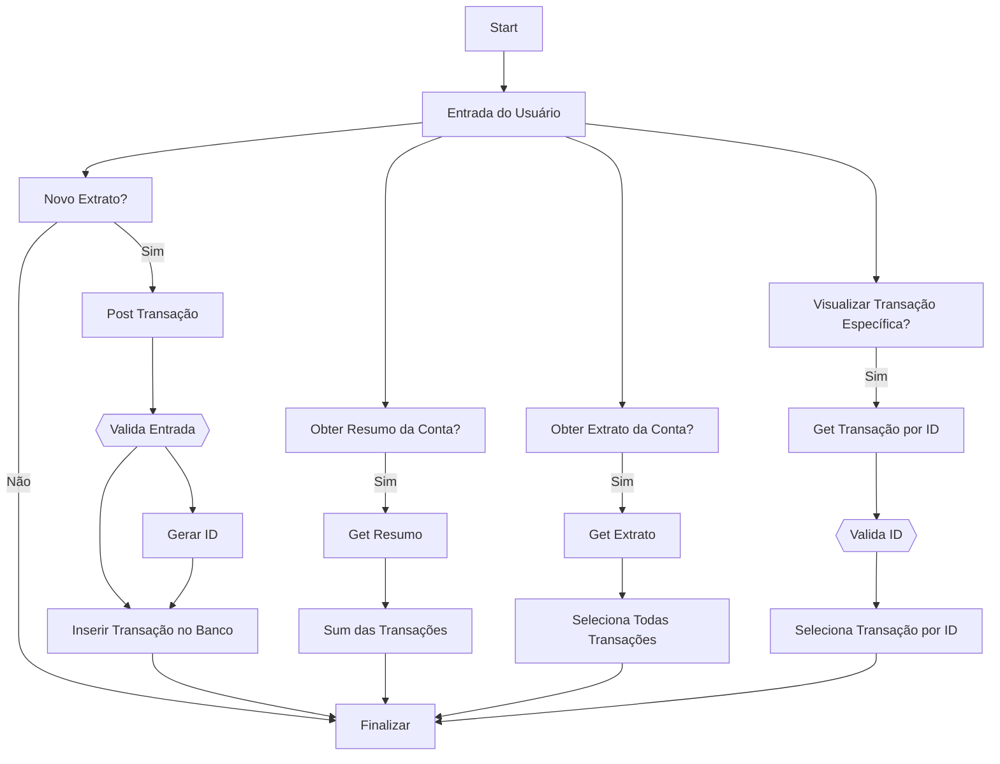

# Requisitos funcionais

- [x] O usuário deve poder criar uma nova transação;
- [x] O usuário deve poder obter um resumo da sua conta;
- [x] O usuário deve poder obter o extrato da sua conta;
- [x] O usuário deve poder visualizar uma transação específica

# Regras de negócio

- [x] A transação pode ser do tipo crédito que somará ao valor total, ou débito subtraindo do valor total;
- [ ] Deve ser possível identificarmos o usuário entre as requisições;
- [ ] O usuário só pode visualizar transações que são dele;

